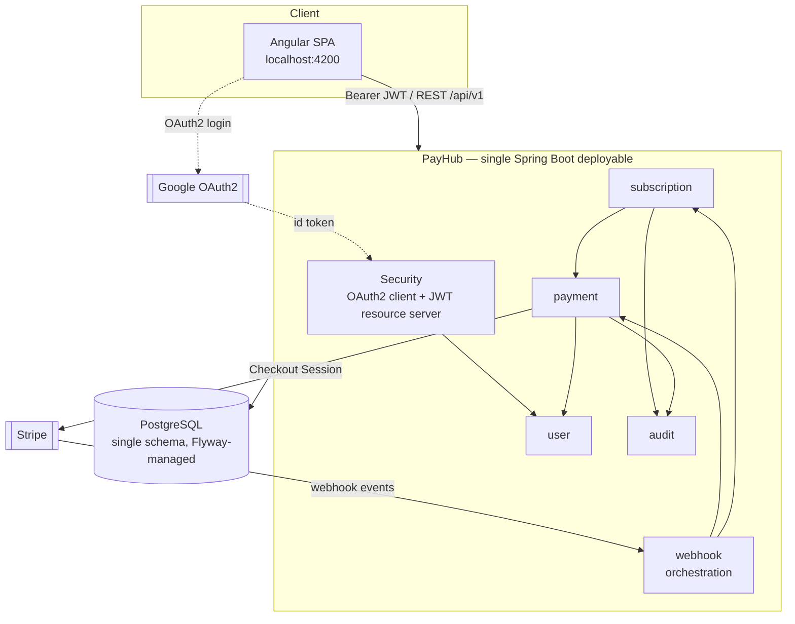
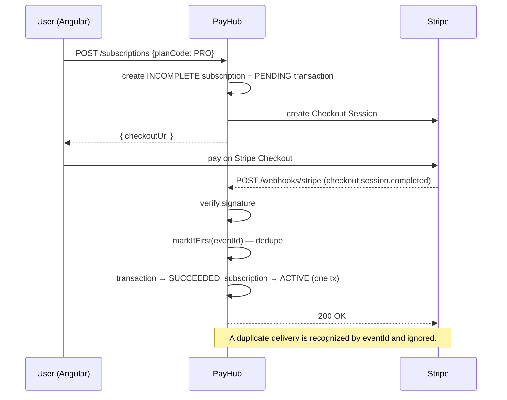

# PayHub — SaaS Subscription Billing Platform

A production-shaped **Spring Boot modular monolith** for SaaS subscription billing:
Google sign-in, tiered plans, Stripe checkout with idempotent webhooks, a compliance
audit trail, and Postgres full-text search over payments — behind a versioned REST API
that an Angular frontend consumes.

> Portfolio project #2. Where my other project **TicketFlow** demonstrates a
> **microservices** architecture, PayHub deliberately demonstrates the opposite end of
> the spectrum — a **well-structured monolith** — and the engineering concerns that shine
> there: transactional integrity, auditability, webhook idempotency, and database-native
> search.

---

## Why a modular monolith (and not microservices)?

Billing is a **tightly coupled, transaction-heavy** domain. Creating a subscription,
recording a payment, and writing an audit entry must succeed or fail **together**. In a
monolith that is a single local transaction; in microservices it becomes a distributed
transaction (sagas, outbox, compensation) — real complexity that this domain does not
justify at this scale.

PayHub is a **modular monolith**: one deployable, one database, one transaction boundary,
but internally split into feature modules (`user`, `subscription`, `payment`, `audit`,
`webhook`) with clear dependencies. This keeps the codebase organized like microservices
would, **without** the operational cost.

| Concern | PayHub (modular monolith) | TicketFlow (microservices) |
|---|---|---|
| Deploy unit | 1 container | many services |
| Data consistency | 1 ACID transaction | distributed / eventual |
| Cross-feature call | in-process method call | network (HTTP/gRPC) |
| Infra needed | app + Postgres | gateway, discovery, per-service DBs, broker |
| Best when | one team, coupled domain, moderate scale | many teams, independent scaling |

The module split means that **if** a part ever needs to scale independently, its boundary
is already drawn.

---

## Architecture



The `webhook` module sits **above** `payment` and `subscription` (it depends on both, and
neither depends on it) so the bean dependency graph stays acyclic.

### Payment + webhook flow (idempotent)



---

## Tech stack

- **Java 21**, **Spring Boot 3.4** (Web, Data JPA, Security, Validation, Actuator)
- **PostgreSQL** with **Flyway** migrations; `tsvector` + GIN full-text search; JSONB audit snapshots
- **Spring Security** as both OAuth2 **client** (Google login) and **resource server** (RS256 JWT), with a JWKS endpoint
- **Stripe** (test mode) via an abstracted gateway
- **springdoc / OpenAPI** (Swagger UI)
- **JUnit 5, Mockito, Testcontainers** (real Postgres in tests); **JaCoCo** 80% gate on business logic
- **Docker** (multi-stage), deployable to Railway / Render

---

## Features

- Google OAuth2 login → app-issued **RS256 JWT**; `GET /me`; public **JWKS**
- Plans **FREE / PRO / ENTERPRISE** with per-tier limits
- Subscribe / change plan / cancel; **one live subscription per user** (enforced in the
  domain and by a Postgres partial unique index)
- **Row-level multi-tenancy** — every query is scoped to the JWT subject; cross-tenant
  access returns 403
- Stripe **Checkout** for paid plans; **idempotent webhooks** activate the subscription
- **Audit trail** (who / when / before / after as JSONB) for compliance
- **Full-text search** over transactions by customer name, plus status and date filters,
  paginated
- Global RFC 7807 error handling, bean validation, CORS for Angular, OpenAPI docs

---

## Package structure

```
com.payhub
├── config/          # Security, CORS, OpenAPI, Stripe, Clock, JWT beans
├── common/          # exceptions (RFC 7807), shared DTOs, ping
├── security/        # OAuth2 login, JWT issue/verify, CurrentUserProvider (tenant id)
├── user/            # accounts (provisioned from Google)
├── subscription/    # plans + subscription lifecycle
├── payment/         # transactions, Stripe gateway (port + impl), search
├── audit/           # immutable audit log
└── webhook/         # Stripe webhook receiver + idempotency (orchestrates payment+subscription)
```

Each feature module is layered internally: `controller / service / repository / domain / dto`.

---

## Getting started

### Option A — Docker Compose (app + Postgres)

```bash
docker compose up --build
```

App on `http://localhost:8080`, Swagger UI at `http://localhost:8080/swagger-ui.html`.

### Option B — run locally against your own Postgres

```bash
cd Backend
./mvnw spring-boot:run
```

Defaults expect Postgres at `localhost:5432` (db/user/pass `payhub`). Override with the
`DB_URL` / `DB_USERNAME` / `DB_PASSWORD` env vars.

### Configuration

Copy `.env.example` to `.env` and fill in real values as needed. The app **boots with
placeholders**; Google login and Stripe simply won't function until real keys are set.

| Variable | Purpose |
|---|---|
| `GOOGLE_CLIENT_ID` / `GOOGLE_CLIENT_SECRET` | Google OAuth2 (redirect URI `…/login/oauth2/code/google`) |
| `STRIPE_SECRET_KEY` | Stripe API key (test mode) |
| `STRIPE_WEBHOOK_SECRET` | verifies webhook signatures (`stripe listen`) |
| `CORS_ALLOWED_ORIGINS` | Angular dev origin(s) |
| `DB_URL` / `DB_USERNAME` / `DB_PASSWORD` | database connection |

---

## Testing

TDD throughout; **65 tests**, ~90% line coverage (JaCoCo enforces **80%** on business
logic at `verify`). Integration tests run against a **real PostgreSQL** via Testcontainers
(H2 cannot emulate `tsvector`), so `docker` must be running.

```bash
cd Backend
./mvnw verify
```

---

## API overview

Full contract at `/swagger-ui.html`. Highlights (all under `/api/v1`, JWT-secured unless noted):

| Method | Path | Notes |
|---|---|---|
| `GET` | `/ping` | public liveness |
| `GET` | `/me` | current user |
| `GET` | `/plans` | plan catalog |
| `POST` | `/subscriptions` | subscribe (returns Stripe `checkoutUrl` for paid plans) |
| `GET` | `/subscriptions/current` | current subscription |
| `PUT` | `/subscriptions/current/plan` | change plan |
| `DELETE` | `/subscriptions/current` | cancel at period end |
| `GET` | `/transactions` | search: `q`, `status`, `from`, `to`, `page`, `size` |
| `GET` | `/audit-logs` | my audit trail |
| `POST` | `/webhooks/stripe` | Stripe webhook (public, signature-verified) |
| `GET` | `/oauth2/jwks` | public JWKS |

---

## Deployment (single container)

The multi-stage `Backend/Dockerfile` produces a self-contained image; the app runs
migrations on startup and exposes `/actuator/health` for platform health checks.

**Railway:** New Project → Deploy from repo → set **Root Directory** to `Backend` (Dockerfile
detected) → add the **PostgreSQL** plugin → set env vars (map `DB_URL`/`DB_USERNAME`/
`DB_PASSWORD` to the plugin's values, plus Google/Stripe keys). Railway injects `PORT`,
which the app already honors.

**Render:** New **Web Service** → Docker → Root Directory `Backend` → add a **PostgreSQL**
instance → set the same env vars. Health check path `/actuator/health`.

Point a Stripe webhook at `https://<your-app>/api/v1/webhooks/stripe` and set
`STRIPE_WEBHOOK_SECRET` accordingly.

---

## Design notes & deliberate simplifications

- **JWT signing keys are generated on startup** (ephemeral) for demo simplicity; production
  should mount stable RSA keys so tokens survive restarts and multiple instances.
- **Audit is recorded explicitly** at the service boundary (not via AOP) so before/after
  snapshots are exact.
- **Stripe checkout uses one-time PAYMENT mode** with inline price data rather than true
  recurring Subscriptions, to avoid pre-provisioning Stripe Prices in a demo.
- **`changePlan` does not prorate/charge** — plan switching is modeled without mid-cycle
  billing.
- **Sessions**: the API is stateless (Bearer JWT); a short-lived session is used only to
  correlate the Google authorization-code handshake.